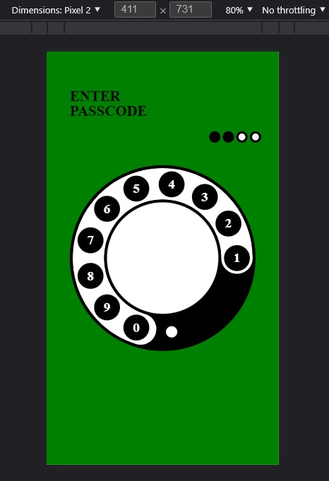

# Painter

Paint your imagination

android: api 21+    
ios : 10.0+   
web : SVG
  
 Example -> [Demo](https://github.com/Only-IceSoul/canal/tree/master/react-native/RotaryLogin)  


## Getting started

`$ npm install react-native-painter --save`  
`$ react-native link react-native-painter`  
  
or

`$ yarn add react-native-painter`
    
## IOS

**Add Swift**

(If you are using expo sdk >=42 you don't need to do this)

/ios/name_project

add a .swift file


# Freatures
- [Color](#color)
- [Common props](#common-props)
- [Elements](#)
  - [Painter](./readmes/painter.md)
  - [Rect](./readmes/rect.md)
  - [Circle](./readmes/circle.md)
  - [Line](./readmes/line.md)
  - [Path](./readmes/path.md)
  - [Ellipse](./readmes/ellipse.md)
  - [Text](./readmes/text.md)
  - [G](./readmes/group.md)
  - [MaskG](./readmes/maskgroup.md)
  - [Mask](./readmes/mask.md)
  - [LinearGradient](./readmes/lineargradient.md)
  - [RadialGradient](./readmes/radialgradient.md)
  - [Image](./readmes/image.md)


### Color:


```js
   import { Color } from 'react-native-painter'

    const colorRed = Color('red')
    const colorBlack = Color('rgba(0,0,0,1)')
    const colorGreen = Color('#00FF00')
        
    

```

### Common props:  


| Name | description | type | default |
| --- | --- | --- | --- |
| mask | Reference of a Mask element | String | undefined |
| opacity | The opacity attribute specifies the transparency | Number | 1 |
| fill | The fill prop refers to the color inside the shape.        | Color | black |
| fillRule | determines what side of a path is inside a shape  | String | nonzero |
| fillOpacity   | the opacity of the color [0 - 1] | Number | 1 |
| stroke | defines the color of a line  | Color | transparent |
| strokeOpacity |  the opacity of the line color [0 - 1]  | Number | 1 |
| strokeWidth | defines the thickness of a line | Number | 1 
| strokeCap | line cap | string | 'butt' |
| strokeJoin | line join | string | 'miter' |
| strokeMiter | control the behavior of miter | Number | 4 |
| strokeStart | the start | Number | 0 |
| strokeEnd | the end | Number | 1 |
| shadow | set the sahdow color  | Color | 'black' |
| shadowOpacity | set the shadow opacity [0 - 1]  | Number | 0 |
| shadowRadius | the radius | Number | 2 |
| shadowOffset | set the offset | Number | 2  |
| shadowOffsetX | set the offset x | Number | 2  |
| shadowOffsetY | set the offset y| Number | 2  |
| shadowPercentageValue | offset * size (mobile)| Bool | false |


### Web:  

| Name | description | type | default |
| --- | --- | --- | --- |
| painterKey | required to shadow,gradient, stroke start, end  | String | "" |
| viewBox | When creating custom views, you must pass the painter props | Array[Number] (4)| undefined |
| align | When creating custom views, you must pass the painter props    | String | xMidYMid |
| aspect | When creating custom views, you must pass the painter props   | String | meet |
| dashArray | required for stroke start and end  | Number | 0 |
| dashClipValue |  useful with cap round & stroke start > 0 & stroke end < 1 [ 0 to 1]| Number | 0 |
| shadowRect | clip Region  | Object | size * 2 |

<br>

### Transform ###  

<br>

The percentageValue property refers to the fact that the Origin will be multiplied by the size of the view.  
  
| Name | type | default |
| --- | --- | --- |
| translateZ (zIndex)(mobile) | Number  | 0 |
| transX | Number | 0 |
| transY | Number | 0 |
| transPercentageValue (mobile) | Bool | false |
| rot | Number | 0 |
| rotO | Number | 0 |
| rotOx | Number | 0 |
| rotOy | Number | 0 |
| rotPercentageValue (mobile) | Bool | false |
| sc | Number | 1 |
| scX | Number | 1 |
| scY | Number | 1 |
| scO | Number | 0 |
| scOx | Number | 0 |
| scOy | Number | 0 |
| scPercentageValue (mobile) | Bool | false |


